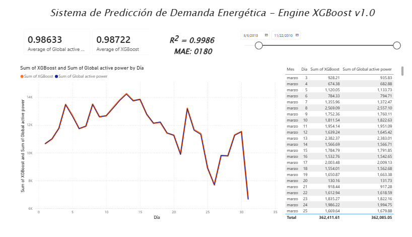
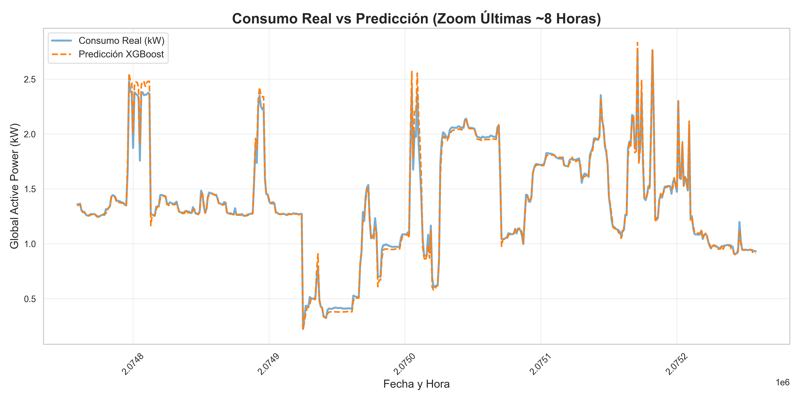

#  Smart Energy Demand Forecasting Dashboard

### Machine Learning + Business Intelligence System (XGBoost + Power BI)

##  Overview

This project delivers an end-to-end system for forecasting energy consumption using machine learning and transforming predictions into actionable insights through an interactive dashboard.

It combines:

* **Predictive modeling (XGBoost)**
* **Time series feature engineering**
* **Business intelligence visualization (Power BI)**

The result is a system that not only predicts energy demand but also enables decision-making through clear and interactive analytics.

##  Business Problem

Energy demand is highly dynamic and influenced by:

* Time of day
* Human activity patterns
* Weekly consumption cycles

Organizations need accurate forecasts to:

* Optimize energy distribution
* Anticipate demand peaks
* Improve resource planning

---

##  Solution

This project builds a **data-driven forecasting system** that:

1. Learns consumption patterns from historical data
2. Predicts future energy demand
3. Visualizes results in an interactive dashboard

---

##  Dataset
To replicate this project, please download the dataset from the UCI Machine Learning Repository and place the household_power_consumption.txt file in the project's root directory.

---

##  Machine Learning Approach

### Feature Engineering

* Time-based features:

  * Hour of day
  * Day of week
  * Month
  * Weekend indicator

* Lag features:

  * 1-hour lag
  * Multi-minute lags

* Rolling statistics:

  * Moving averages

* Cyclical encoding:

  * Sin/Cos transformations

---

### Model

* **XGBoost Regressor**
* Captures nonlinear patterns and temporal dependencies
* Well-suited for structured time series data

---

### Evaluation Strategy

* Chronological train/test split (no data leakage)
* Evaluation on unseen future data

---

##  Model Performance

* **MAE:** 0.0180
* **R² Score:** 0.9986

The model achieves very high predictive accuracy, closely tracking real consumption patterns and capturing short-term fluctuations.

---

## Dashboard (Power BI)

The Power BI dashboard transforms model outputs into business insights.

### Key Features:

*  Real vs Predicted Consumption
*  Time-based filtering (date range slider)
*  Trend analysis by day
*  Tabular breakdown of predictions vs actual values
*  KPI indicators (average consumption vs model output)

---

##  Insights

* Energy consumption follows strong temporal patterns
* Short-term demand can be accurately predicted using lag-based features
* Machine learning models can effectively capture both trends and spikes

---

##  Business Value

This system enables:

* Demand forecasting for energy providers
* Better operational planning
* Early detection of abnormal consumption patterns
* Data-driven decision-making

---

##  Technologies Used

* Python (Pandas, NumPy, Scikit-learn)
* XGBoost
* Matplotlib / Seaborn
* Power BI

---

##  Future Improvements

* Real-time prediction pipeline
* Integration with IoT or streaming data
* Model deployment as API
* Advanced model tuning and validation
* Interactive web dashboard (Streamlit)

---

##  Author

Jose Aron Salgado Ramirez

